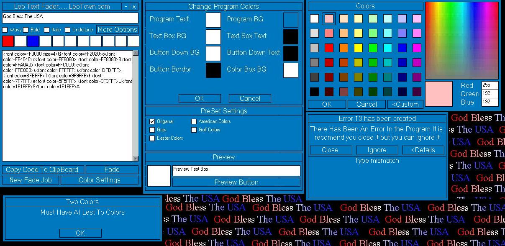

<div align="center">

## \[ leo html text fader \]


</div>

### Description

leo text fader is a fader that fades text from one color to the next and generates the html code. fade up to 11 colors many options. i worked hard so please vote. the forms also have no frams and are movible in all all windows plateforms. my own code. all code in the project is 100% mine except for the keep on top code all other is mine the whole project is pure vb code except for the kepp on top withch is compadible with all windows platforms. project is essy to add more colors if you want
 
### More Info
 
text, and colors

need to know basic html to insert into your websites

html code


<span>             |<span>
---                |---
**Submitted On**   |2002-01-21 13:42:36
**By**             |[Vblifeline](https://github.com/Planet-Source-Code/PSCIndex/blob/master/ByAuthor/vblifeline.md)
**Level**          |Advanced
**User Rating**    |4.8 (183 globes from 38 users)
**Compatibility**  |VB 6\.0
**Category**       |[Internet/ HTML](https://github.com/Planet-Source-Code/PSCIndex/blob/master/ByCategory/internet-html__1-34.md)
**World**          |[Visual Basic](https://github.com/Planet-Source-Code/PSCIndex/blob/master/ByWorld/visual-basic.md)
**Archive File**   |[\[\_leo\_html502641212002\.zip](https://github.com/Planet-Source-Code/vblifeline-leo-html-text-fader__1-31040/archive/master.zip)

### API Declarations

```
Public Declare Function SetWindowPos Lib "user32" (ByVal hwnd As Long, _
 ByVal hWndInsertAfter As Long, ByVal X As Long, Y, ByVal cx As Long, _
 ByVal cy As Long, ByVal wFlags As Long) As Long 'that all
```


